# Развертывание проекта с помощью Docker
1. Склонировав проект, нужно создать файл `.env` в корневой директории проекта, скопировать из `.env.example` параметры и установить новые значения (если требуется)
2. Далее, из этой же корневой директории нужно выполнить ```docker compose build```  
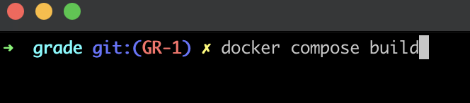  
3. Если все успешно, то будет собран образ:
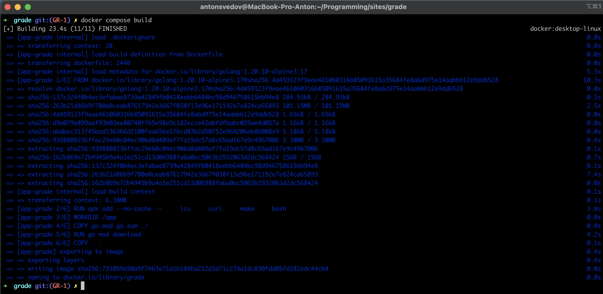  
4. Теперь из этой же директории выполнить ```docker compose -p 'grade' up -d```  
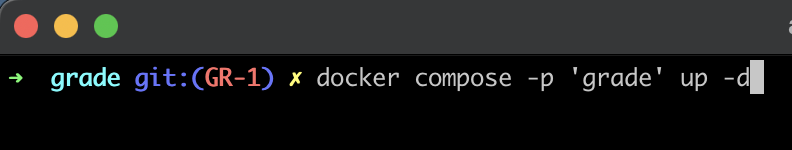  
5. Если все успешно, будут созданы контейнеры:  
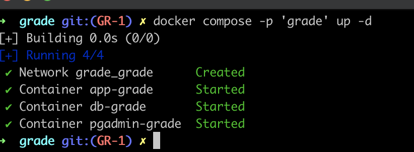  
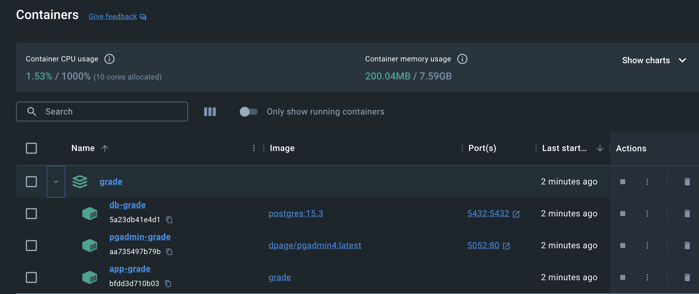  
- вывода в консоли может быть больше, если нету уже ранее созданных контейнеров `pgAdmin` и `PostgreSQL`  
6. Далее нужно открыть контейнер с `PostgreSQL` - `db-grade` в консоли (ну или зайти в контейнер через `exec`):
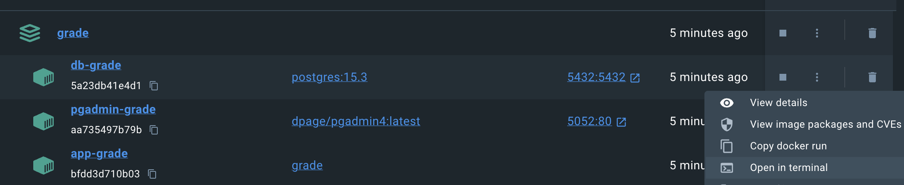   
7. В данном контейнере выполнить `bash`  
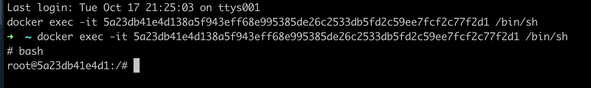  
- и перейти в директорию в `app` - `cd app` (по умолчанию откроется сразу данная директория, но лучше убедиться) 
8. После в этом же контейнере и директории `app` выполнить команду ```psql -U devel -p 5432 -d devel_grade < ./grade/internal/infrastructure/sql/init.sql```  
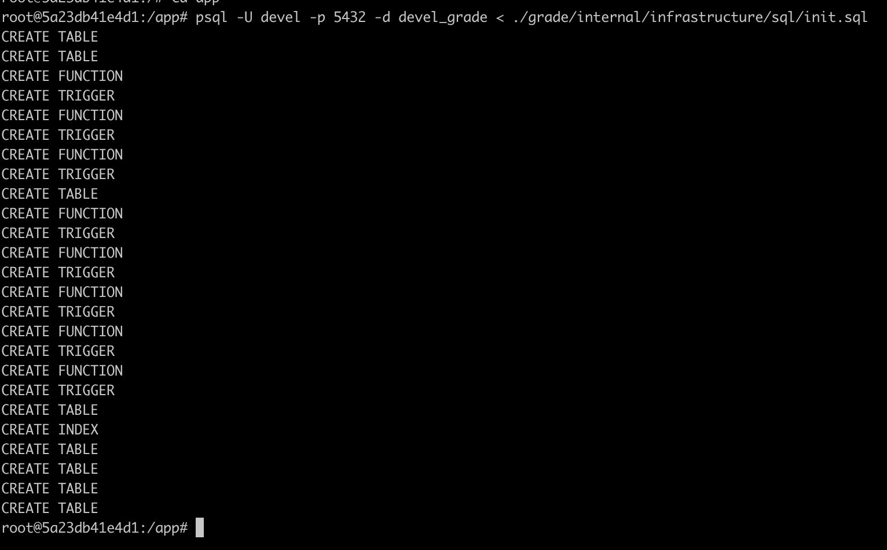  
- если все успешно, БД будет "поднята"
9. Теперь осталось настроить `pgAdmin` (если нужно)

# Настройка подключения pgAdmin
1. Открыть в браузера контейнер с `pgAdmin` - `pgadmin-grade`  
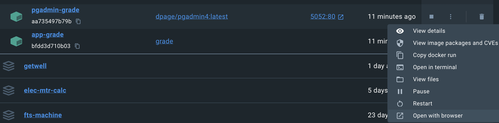  
2. Откроется страница с предложением ввести пароль:
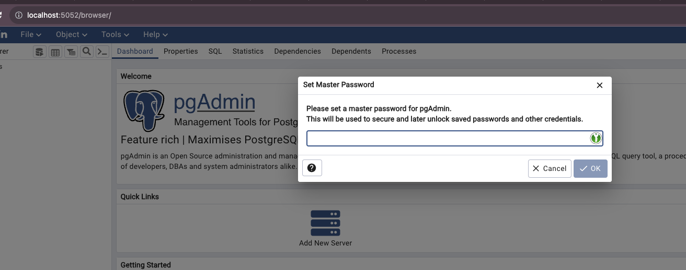  
- пароль вводим из `.env`, указанный в параметре `DB_PASSWORD`  
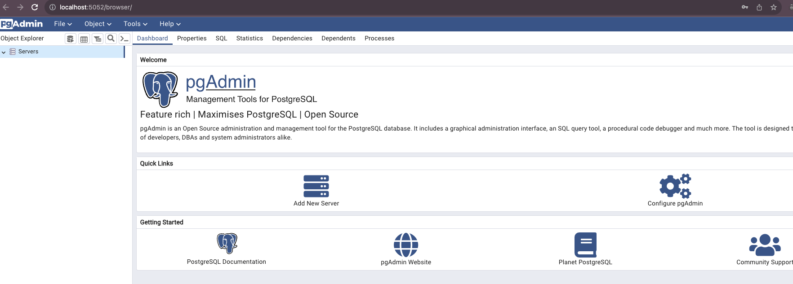  
3. Теперь нужно настроить сервер, нажимаем на иконку `Add New Server`  
- вводим имя сервера  
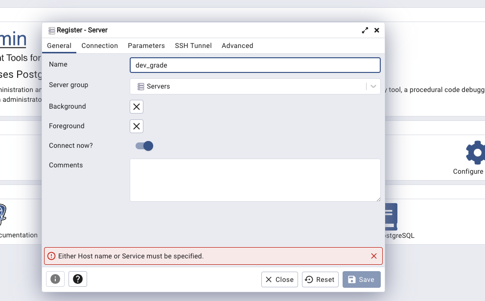
- вводим настройки подключения  
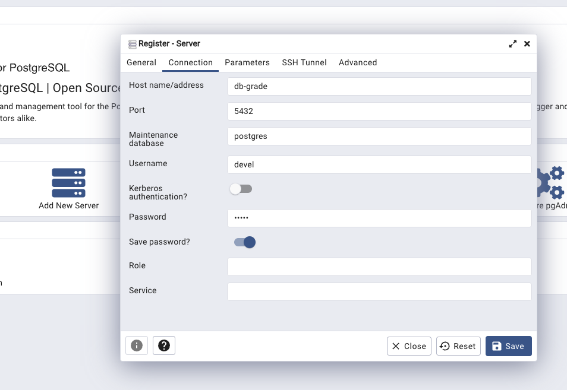  
- если все успешно, сервер будет создан и будет доступна БД и ее таблицы  
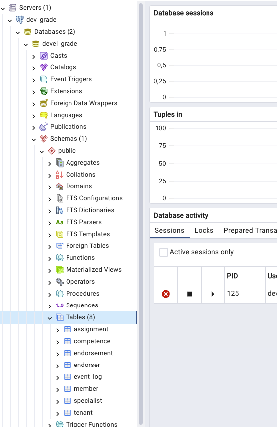

# Проверка правильности развертывания
1. Если вышеперечисленные шаги выполнены верно, можно проверить пройдут ли тесты
2. Заходим в контейнер `app-grade` и выполняем команду `make test`:
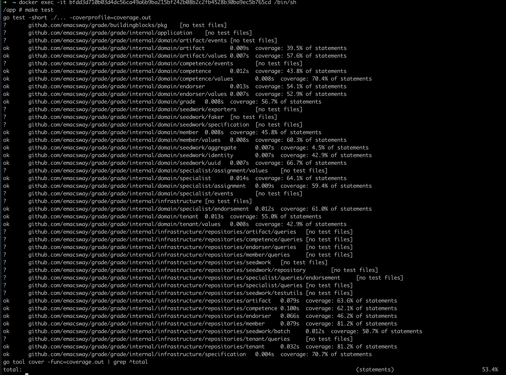  
3. И проверим таблицу `member`:
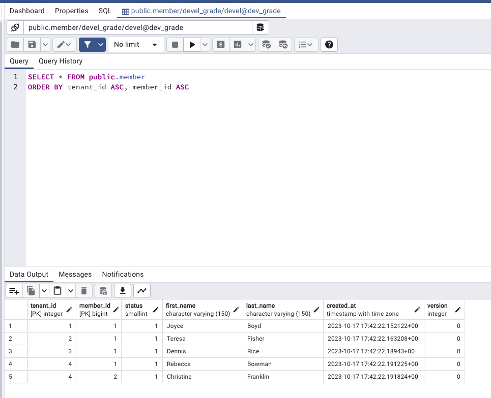
4. Приложение развернуто.